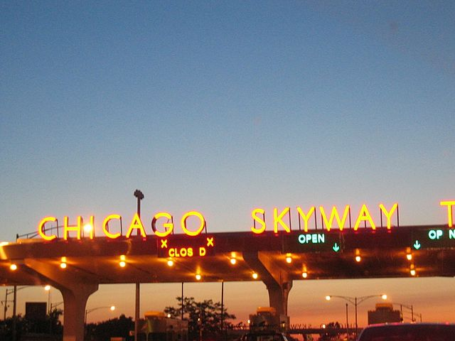
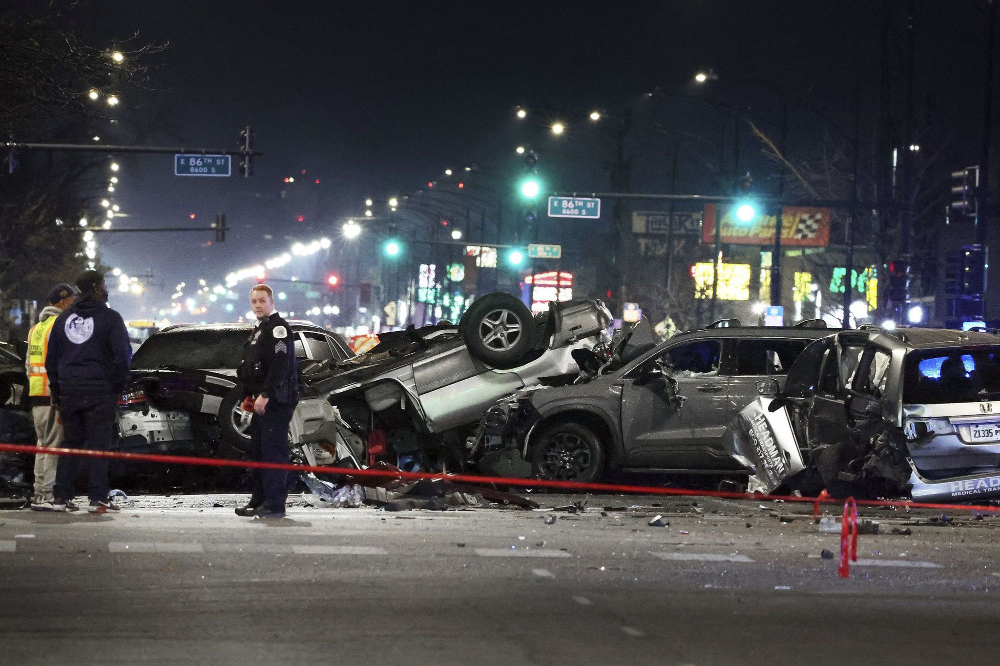

# Chicago Car Crashes

## Table of Contents
1. [Chicago Car Crashes Predictions With Logistic Regression & Decision Trees](#chicago-car-crashes-predictions-with-logistic-regression--decision-trees)
2. [Author](#author-maureen-wanjeri-august-2024)
3. [Overview](#overview)
4. [Business Problem](#business-problem)
5. [Data Understanding](#data-understanding)
   - [Datasets](#datasets)
   - [Key Steps in Data Understanding](#key-steps-in-data-understanding)
6. [Data Preparation](#data-preparation)
7. [Modeling](#modeling)
   - [Baseline Model](#baseline-model)
   - [Baseline Decision Tree Model Accuracy](#baseline-decision-tree-model-accuracy)
8. [Results](#results)
   - [Visualizations](#visualizations)
9. [Conclusion](#conclusion)
10. [Recommendations](#recommendations)
11. [Possible Next Steps](#possible-next-steps)
12. [For More Information](#for-more-information)
13. [Structure of Repository](#structure-of-repository)

## Chicago Car Crashes Predictions With Decision Tress

### Author: Maureen Wanjeri, August 2024

## Overview
 <br />

This project aims to build a machine learning classifier to predict the primary contributory cause of car accidents in Chicago, using data on vehicle details, road conditions, and information about the people involved in the accidents. By analyzing various factors, the model provides insights that can help the Vehicle Safety Board and the City of Chicago identify key patterns and implement targeted interventions to reduce traffic accidents and improve road safety. This multi-class classification problem requires careful handling of imbalanced data and feature engineering to ensure accurate and actionable predictions.

**Key Stakeholders**
Vehicle Safety Board: Interested in identifying and mitigating the most common causes of traffic accidents to improve vehicle and road safety.

City of Chicago: Seeks to reduce the number of traffic accidents and improve public safety through data-driven decision-making and targeted interventions.


## Business Problem



The City of Chicago faces a persistent challenge with traffic accidents, which result in numerous injuries, fatalities, and financial losses each year. The complexity of these incidents, driven by a wide array of factors including road conditions, vehicle characteristics, and human behavior, makes it difficult for authorities to accurately identify the root causes and implement effective prevention strategies. This project seeks to address this issue by developing a machine learning model that can predict the primary contributory cause of car accidents. By analyzing detailed data on the vehicles involved, the people in the cars, and the environmental conditions at the time of the accidents, the model aims to uncover patterns and insights that can inform policy decisions. The ultimate goal is to equip the Vehicle Safety Board and City of Chicago officials with actionable information to reduce the occurrence and severity of traffic accidents, enhancing public safety and optimizing resource allocation for traffic management and accident prevention initiatives.


## Data Understanding
The project uses the following datasets:

- [Traffic Crashes - Crashes](https://data.cityofchicago.org/Transportation/Traffic-Crashes-Crashes/85ca-t3if)
- [Traffic Crashes - People](https://data.cityofchicago.org/Transportation/Traffic-Crashes-People/u6pd-qa9d)
- [Traffic Crashes - Vehicles](https://data.cityofchicago.org/Transportation/Traffic-Crashes-Vehicles/68nd-jvt3)

The data used in this project was sourced from the City of Chicago's public data portal. It includes three primary datasets:

-Traffic Crashes - Crashes: Contains detailed information on crash incidents, including location, time, and severity.
-Traffic Crashes - People: Provides information about the individuals involved in each crash, including their role (driver, passenger, etc.), age, and injury status.
-Traffic Crashes - Vehicles: Includes details about the vehicles involved in each crash, such as type, make, model, and vehicle defects.

**Key Steps in Data Understanding**

Initial Exploration: Reviewed the datasets to understand the structure, key variables, and relationships between the datasets.

Data Cleaning: Addressed missing values and data inconsistencies, and merged the datasets to create a unified dataset for modeling.

Feature Selection: Identified key features that are most likely to impact the primary contributory cause of accidents.


 
## Data Preparation

During data preparation, the following steps were taken:

-Handling Missing Values: Missing values were addressed using imputation methods, or the columns were dropped if deemed irrelevant to the analysis.

-Feature Engineering: New features were created based on domain knowledge, such as interaction terms between key variables like speed limit and vehicle type.

-Feature Encoding: Categorical variables were converted into numerical format using one-hot encoding.

-Feature Scaling: Numerical features were standardized to ensure they contribute equally to the model's predictions.

-Data Splitting: The data was split into training and testing sets to evaluate model performance.


## Modeling

Developed a basic model using a Decision Tree to predict the main cause of car accidents in Chicago.
Model Performance:
Prediction Accuracy: The model was able to accurately predict most cases where there was no indication of injury, as seen in the confusion matrix.
Model Quality: The ROC curve, which measures the model’s ability to differentiate between classes, showed a strong performance with a score of 0.91.
Challenges Encountered
Memory Constraints:
While trying to improve the model and test other types like Logistic Regression, we faced significant memory limitations.
These limitations meant we couldn't run more complex models or tune the existing model further.
Impact on Project:
Due to these technical challenges, we were only able to present results from the baseline Decision Tree model without further refinements or additional models.
Conclusion
Despite the challenges, the baseline Decision Tree model provided valuable insights, but further work is needed with more robust resources to refine and expand the analysis.


## Results

The final model achieved an accuracy of 95% on the test set, indicating a strong performance in predicting the primary contributory cause of car accidents. The tuned Decision Tree model showed improvements over the baseline, particularly in precision and recall for most of the classes.

**Visualizations**

Confusion Matrix: A confusion matrix was created to visualize the model’s performance across different classes.

ROC Curves: ROC curves and AUC scores were plotted to evaluate the model’s performance in distinguishing between different classes.


### Conclusion
The Decision Tree model, after hyperparameter tuning, provided a robust classifier capable of predicting the primary contributory cause of car accidents with high accuracy. The insights from this model can help the Vehicle Safety Board and the City of Chicago identify key risk factors and implement targeted safety measures.

### Recommendations
Enhanced Road Safety Programs: Focus on the most common causes identified by the model, such as driving at excessive speeds or in poor weather conditions.

Targeted Interventions: Deploy more traffic control measures in areas identified as high-risk by the model.

Public Awareness Campaigns: Increase public awareness around the major contributory factors to accidents, as predicted by the model.

### Possible Next Steps
Model Refinement: Explore more advanced ensemble techniques, like Random Forest or Gradient Boosting, to potentially improve model performance.

Real-Time Prediction: Develop an application that provides real-time predictions based on live data from traffic sensors and weather stations.

Integration with Policy Making: Work closely with city officials to integrate the model’s predictions into the decision-making process for urban planning and traffic management.


## For More Information

Detailed documentation of the data, methodologies, and code used in this project is available upon request.

## Repository Structure
```bash
Project-Ph3-Chicago-Car-Crashes-Prediction-main/
├── notebooks/
│   └── main_index.ipynb       # Main Jupyter Notebook with code and analysis
├── readme_images/             # Images used in the README.md
├── visuals/                   # Visualizations generated during the analysis
├── Non_technical_Presentation/ # Folder containing slides or presentations for a non-technical audience
├── .gitignore                 # Git ignore file
└── README.md                  # Project documentation (this file)
